
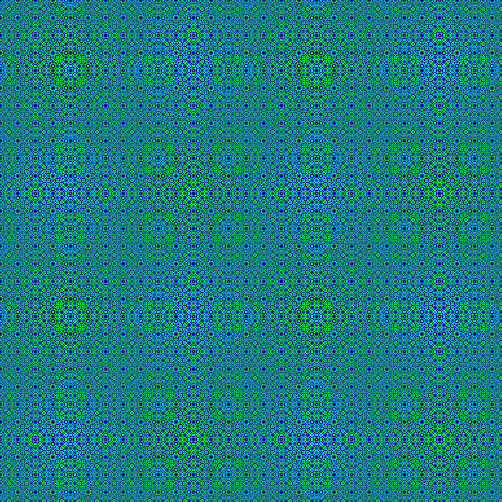


# genart
Generative Art in Go: httpd server and cli command line

Generate images (patterns) from a simple formula:

    color = ( C - C * X * Y ) mod MAX

`C` is a constante, ``(X, Y)` coordinates and MAX the number of colors.

## How to use

### cmd line

To get help:

```
$ bin/genart -help
Usage of bin/genart:
  -colors int
    	number of colors (default 216)
  -constant int
    	constant for formula (c): c-c*x*y (default 10)
  -filename string
    	filename to save image (.png) (default "formulaimg.png")
  -formula string
    	formula to use (default "ccxy")
  -size int
    	size of image (default 1000)
```

Generating an image:

```
$ make genart
$ bin/genart -filename output.png -colors 100
```

### http server

To get the same image from above cmd line example:

```
make runserver
```

Then, on another terminal (or from browser):

```
$ curl -v http://127.0.0.1:8090/ccxy/size/1000/constant/10/colors/100/ --output output.png
```

### The image


#### Another images

##### formula: ccxy, size:1000, constant:20, colors:200

```
$ curl -v http://localhost:8090/ccxy/size/1000/constant/20/colors/200/ --output images/ccxy_size:1000_constant:20_colors:200.png
$ bin/genart -formula=ccxy -size=1000 -constant=20 -colors=200 -filename=images/ccxy_size:1000_constant:20_colors:200.png
```



##### formula: xcyc, size:1000, constant:2, colors:70

```
$ curl -v http://localhost:8090/xcyc/size/1000/constant/2/colors/70/ --output images/xcyc_size:1000_constant:2_colors:70.png
$ bin/genart -formula=xcyc -size=1000 -constant=2 -colors=70 -filename=images/xcyc_size:1000_constant:2_colors:70.png
```



##### formula: ccxy, size:1000, constant:2, colors:70

```
$ curl -v http://localhost:8090/ccxy/size/1000/constant/2/colors/70/ --output images/ccxy_size:1000_constant:2_colors:70.png
$ bin/genart -formula=ccxy -size=1000 -constant=2 -colors=70 -filename=images/ccxy_size:1000_constant:2_colors:70.png
```



### Previous works (pt-br)

* [Arte generativa com fórmula simples em Go](https://paulohrpinheiro.xyz/texts/go/2024-01-08-arte-generativa-formula-simples.html)
* [Testando o novo mux no GO 1.22](https://paulohrpinheiro.xyz/texts/go/2024-01-04-testando-o-novo-mux-no-golang-1_22.html)
* [Gerando imagens em GO com biblioteca padrão](https://paulohrpinheiro.xyz/texts/go/2019-02-18-gerando-imagens-em-go-com-biblioteca-padrao.html)
* [ Lisp (racket scheme) programs to draw digital art](https://github.com/paulohrpinheiro/generative-art)
